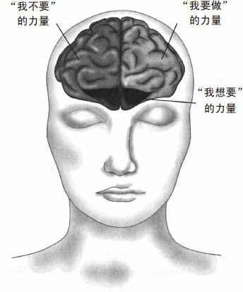

# 意志力是什么

意志力就是驾驭==“我要做”、“我不要”和“我想要”==这三种力量。“我要做”和“我不要”是自控的两种表现，但它们不是意志力的全部。你还得有第三种力量：那就是牢记自己真正想要的是什么。

## “我要做”“我不要”和“我想要”的神经学原理

前额皮质是位于额头和眼睛后面的神经区，它主要控制人体的运动，比如走路、跑 步、抓取、推拉等，这些都是自控的表现。

随着人类不断进化，前额皮质也逐渐扩大，并和大脑的其他区域联系得越来越紧密。现在，人脑中前额皮质所占的比例比其他物种大很多。这就是为什么你的宠物狗不会把狗粮存起来养老，而人却会未雨绸缪。前额皮质扩大之后，就有了新的功能。它能控制我们去关注什么、想些什么，甚至能影响我们的感觉。这样一来，我们就能更好地控制自己的行为。

**现代人大脑里前额皮质的主要作用是让人选择做“更难的事”。**前额皮质并不是挤成一团的灰质，而是分成了三个区域，分管“我要做”“我不要”和“我想要”三种力量（见图1-1）。前额皮质的左边区域 负责“我要做”的力量。它能帮你处理枯燥、困难或充满压力的工作。比如，当你想冲个澡的时候，它会让你继续待在跑步机上。右边的区域则控制“我不要”的力量。它能克制你的一时冲动。比如，你开车时没有看短信，而是盯着前方的路面，就是这个区域的功劳。以上两个区域一同控制你“做什么”。

图1-1

三个区域位于前额皮质中间靠下的位置。它会记录你的目标和欲望，决定你“想要什么”。这个区域的细胞活动越剧烈，你采取行动和 拒绝诱惑的能力就越强。

## 两个自我导致的问题

进化保留了曾为我们效劳的本能，即使那些本能如今会给我们带来麻烦。不过好处在于，我们如今有了解决麻烦的能力。

有些神经学家甚至认为，我们只有一个大脑，但我们有两个想法。 或者说，我们的脑袋里有两个自我。一个自我任意妄为、及时行乐，另一个自我则克服冲动、深谋远虑。两个自我发生分歧的时候，总会有一方击败另一方。决定放弃的一方并没有做 错，只是双方觉得重要的东西不同而已。

**意志力挑战就是两个自我的对抗。在意志力挑战中获胜的关键，在于学会利用原始本能，而不是反抗这些本能**。

# 意志力第一法则：认识你自己

自我意识就是：当我们做一件事的时候，我们能意识到自己在做什么，也知道我们为什么这样做。但愿我们还能知道，在做这件事情之前我们需要做些什么，这样我们就会三思而后行。

这听上去似乎很简单。但心理学家知道，==大部分人作决定的时候就像开了自动挡，根本意识不到自己为什么作决定，也没有认真考虑这样做的后果。最可恨的是，我们有时根本意识不到自己已经作了决定==。比如，有一项研究调查人们每天做多少和食物相关的决定。要是问你的话，你会怎么说？人们平均会猜14个。但如果我们真去数的话，这种决定大约有227个。人们是在毫无意识的情况下作出这200多个选择的。而 这仅仅是和食物相关的决定。如果你都不知道自己在作决定，又怎么能控制自己呢？

## 意志力实验：回忆一下你的决定

**如果你想有更强的自控力，就得有更多的自我意识**。**首先你得知道，什么样的决定需要意志力**。有些决定比较明显，比如“下班后要不要去健身？”但有些冲动的后果可能要过些日子才会显现。 比如，你是不是先装好了运动背包，以便不用回家就能去锻炼？ （这是个不错的做法！这样你就没那么多借口了。）你是不是接了个电话，然后聊着聊着就饿了，没办法直接去健身了？（哎呀！你要是先去吃饭，八成就不会去健身了。）

==请至少选一天，把你作的决定都记下来。在这一天结束的时候，回想你作的决定，分析**哪些有利于你实现目标，哪些会消磨你的意志**==。坚持记录你的决定，还有助于减少在注意力分散时作决定，同时增强你的意志力。

# 训练大脑，增强意志力

在过去10年里， 神经学家发现，人脑像一个求知欲很强的学生，对经验有着超乎大家想象的反应。如果你每天都让大脑学数学，它就会越来越擅长数学。如果你让它忧虑，它就会越来越忧虑。如果你让它专注，它就会越来越专注。

## 意志力实验：5分钟训练大脑冥想

专心呼吸是一种简单有效的冥想技巧，它不但能训练大脑，还能增强意志力。

1. 原地不动，安静坐好。

   坐在椅子上，双脚平放在地上，或盘腿坐在垫子上。背挺直， 双手放在膝盖上。冥想时一定不能烦躁，这是自控力的基本保证。

2. 注意你的呼吸。

   闭上眼睛。注意你的呼吸。吸气时在脑海中默 念“吸”，呼气时在脑海中默念“呼”。当你发现自己有点走神的时 候，重新将注意力集中到呼吸上。

3. 感受呼吸，弄清自己是怎么走神的。

   几分钟后，你就可以不再默念“呼”、“吸”了。试着专注于呼吸 本身。你会注意到空气从鼻子和嘴巴进入和呼出的感觉，感觉到吸气时胸腹部的扩张和呼气时胸腹部的收缩。

刚开始的时候，你每天锻炼5分钟就行。习惯成自然之后，请试着每天做10～15分钟。如果你觉得有负担，那就减少到5分钟。

实际上，冥想时 感觉“很糟糕”才能让训练有效果。==自控力是一个过程，在这个过程中，人们不断偏离目标，又不断把注意力收回来==。冥想时的感觉越“糟糕”，它在现实生活中的作用就越明显。最重要的是，你在走神的时候要能意识到这一点。